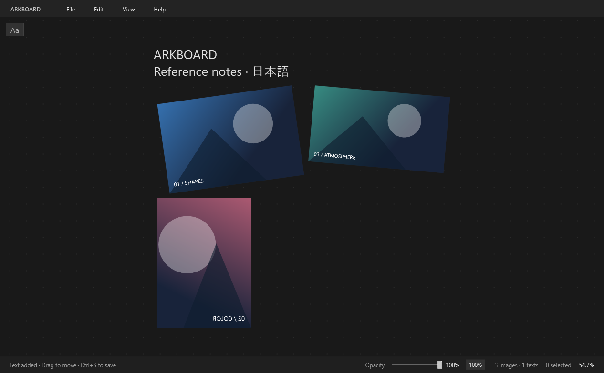
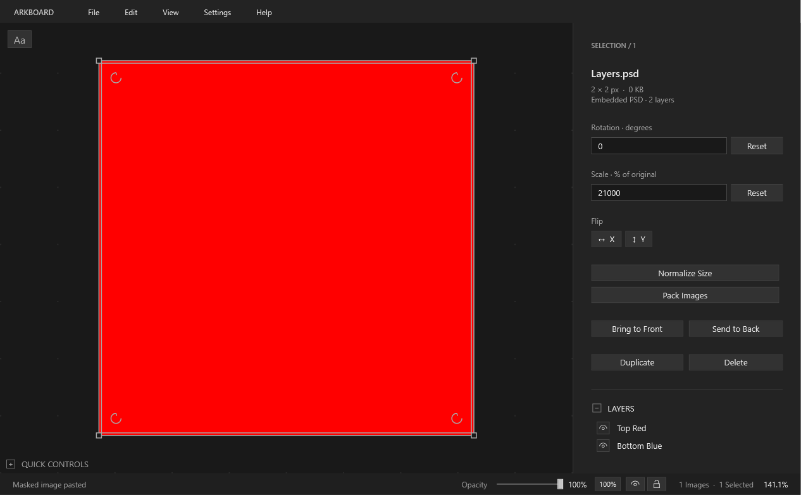

# ArkBoard 1.10.1

A portable reference-image canvas for Windows. Projects contain all their image assets.



ArkBoard is open-source software released under the [MIT License](LICENSE). Prebuilt portable versions are available from the repository's Releases page.

## In development

- Open BeeRef `.bee` versions 1 and 2 as read-only imports for migration into ArkBoard. Embedded images, text, stacking order, transforms and crops are transferred; source files are never overwritten.
- Per-image opacity and grayscale are reported but intentionally ignored during BeeRef import.

## Cross-application overlay lock fix in 1.10.1

- Locked ArkBoard now uses a native layered click-through window, so viewport input reaches applications in other processes such as ZBrush.
- Slider, eye and lock move into a small independent control strip while locked. They remain interactive and never fade below 50%, even when the board is at 5% opacity.
- The Quick Controls scrollbar is now 6 pixels wide.

## Overlay lock in 1.10.0

- The eye button beside Opacity toggles **Always on Top**. The lock button makes the rest of ArkBoard click-through, allowing direct work in an application such as ZBrush beneath a translucent reference board.
- While locked, the opacity controls and lock button remain interactive. The eye intentionally stays locked with the rest of the window until the board is unlocked.
- Quick Controls now includes every implemented editing, project and navigation shortcut. Double-clicking empty canvas space continues to fit all board content.

## PSD compositing fix in 1.9.1

- PSD raster layers now render in the same stacking order shown by Photoshop and the ArkBoard sidebar. A higher layer such as `retouch` correctly appears over a lower background layer while both remain enabled.
- The language choices are always labeled **English / Italiano / 日本語**, independently of the active interface language.

## Interface and navigation in 1.9.0

- **Settings → Language** switches the interface immediately between English, Italian and Japanese.
- **Alt + middle-button drag** zooms vertically. Down zooms in by default; **Settings → Invert Alt + Middle Drag Zoom** reverses it.
- Double-clicking empty canvas space fits the complete board.
- PSD layer names follow Photoshop's visual stacking order. A selected layered image uses a double outline so it remains easy to identify.
- Help and the unsaved-changes confirmation now use ArkBoard's dark square-edged UI. Help presents compatible files, Windows support, the MIT license and the GitHub repository without a shortcut list.
- Quick Controls and Layers use square outline-only expanders. `AGENTS.md` records architecture, build and release context for future development sessions.

## Quick Controls backplate in 1.8.2

- The Quick Controls backplate is 85% opaque, allowing the canvas to remain visible beneath it while keeping the shortcut text readable.
- Backdrop blur is intentionally omitted because WPF would need to render the covered canvas a second time, which would add continuous rendering cost on large boards.

## Compact sidebar in 1.8.1

- The 360-pixel selection sidebar uses compact Rotation and Scale rows with inline Reset buttons, followed by Flip, mask, layout, stacking and object actions.
- The PSD layer list now sits at the bottom of the object controls behind a clear separator.
- **Quick Controls** moved to the bottom-left of the canvas. It starts expanded, uses a dark readable background over images and collapses to a small toggle header.

## PSD layers and reset shortcuts in 1.8.0

- Import a standard **8-bit RGB PSD** and select it to open **PSD Layers** in the inspector. Each supported raster layer has an ON/OFF checkbox.
- Layer visibility belongs to each canvas object, supports undo/redo and copy/paste, and is saved with the embedded original PSD in the `.arkboard` project.
- **Alt+S** resets scale to 100%, **Alt+R** resets rotation to 0°, and **Alt+M** removes the non-destructive ArkBoard mask.
- PSD support is deliberately basic: raw and PackBits/RLE raster channels are composited normally. Photoshop blend modes, effects, layer masks, adjustment layers, smart objects, 16/32-bit documents, ZIP-compressed layer channels and PSB are not interpreted.



## Selection controls in 1.7.1

- A normal image selection shows only the four corner scale handles. The inactive midpoint squares and the old top-center rotation stalk have been removed.
- Four inset circular-arrow anchors rotate an image. Their hit areas are larger than their visible marks, and hovering one uses a dedicated rotation cursor.
- Holding **Shift** while the pointer is over an image immediately previews the four midpoint mask handles. Existing masks also show their visible solid outline and original dashed bounds before a click.

## Start

Extract the ZIP and run **ArkBoard.exe**. Keep **ArkBoard.exe.config** beside it. No installer, account, Python or development SDK is required. Requirements: Windows 10/11 x64 and .NET Framework 4.8. Open **Example.arkboard** to try a sample board. Existing RefCanvas projects remain compatible. BeeRef `.bee` projects can be opened as read-only imports and then saved as new `.arkboard` projects.

## Mask refinement and clipboard in 1.7.0

- **Ctrl+C / Ctrl+V** inside ArkBoard preserves an image's mask, dimensions, rotation and flips. The clipboard also carries a standard bitmap for pasting into other Windows applications.
- **Shift+click** a masked image to enter mask-adjustment mode. The visible mask has a solid outline and handles; the original image bounding box remains visible with a dashed outline.
- While mask-adjustment mode is active, **Shift+drag** the visible image to move the mask window inside the original bounds without changing its size. Shift+dragging a mask edge continues to refine that edge.

## Masking and auto-sorting in 1.6.0

- Hold **Shift** and drag from the middle area of an image edge to mask it non-destructively. The original image remains embedded and its full bounding box stays visible when selected. Drag the masked edge outward to reveal pixels again, or use **Remove Mask** in the selection panel.
- **Settings → Auto-Sorting** is enabled by default. When an image starts moving, its selected group immediately moves to the top of the stacking order. Disable the toggle to preserve the current order while dragging; it returns to the enabled default when ArkBoard restarts.
- Masked projects use manifest version 3. ArkBoard continues to open version 1 image boards and version 2 boards containing text.

## Text editing in 1.5.0

- Double-click a text object to edit its contents in place. Esc or a click outside confirms the edit; an empty edit deletes the object. Text edits operate on the existing object and support undo/redo.
- Text objects support movement and proportional scaling. Rotation and horizontal/vertical flipping apply only to images; their controls and rotation anchors are hidden for a text-only selection.

## New in 1.4.2

- Updated the application and `.arkboard` file icon with the revised ArkBoard artwork.

## Text tool in 1.4.1

Click **Aa** at the top-left inside the canvas, or press **Ctrl+T**. Drag and release to choose the font size, then type at the blinking caret. Enter adds a new line; Esc or a click outside the editor confirms the text. The Aa button stays fixed while panning and zooming.

Confirmed text becomes a movable canvas object and supports resizing, duplication, deletion and undo/redo. Text is saved inside the project. Open **Example-with-text.arkboard** for a sample. Projects containing text use manifest version 2 and require ArkBoard 1.4 or newer; older image-only projects remain supported.

## New in 1.3.2

- The supplied ArkBoard logo is embedded in the executable and application window at 32, 64, 128 and 256 pixels. No external icon files are required.

## New in 1.3.1

- The toolbar has been removed to give the canvas more space. Right-click the canvas for Import Images, Open Project, Save Project, Undo, Redo, Fit All and Pack Images, along with the existing editing commands.
- The context menu uses a fully dark template without the native white icon gutter. Undo/Redo reflect the available history; keyboard shortcuts are unchanged.

## Rendering improvements in 1.3

- The application is now **ArkBoard**. New projects use `.arkboard`; existing `.refcanvas` projects still open, including by drag and drop. Save As lets you migrate an old project without altering the original.
- At 100% opacity, ArkBoard uses the normal opaque WPF window presentation path. Layered transparency is enabled only below 100% and removed again when opacity is reset.
- Zooming, dragging and window resizing use fast bilinear image sampling. Full-quality sampling returns after 180 ms without interaction.
- The canvas grid uses one repeated drawing tile instead of thousands of dot drawing commands as the window grows.

## Layout commands

- **Normalize Size — Ctrl+A:** available in the selection panel, Edit menu and context menu. Select at least two images. Each image's longest side becomes the arithmetic mean of the selected images' current longest sides. For example, images with longest sides of 200 and 800 become 500 each. Aspect ratios, centers, rotations and flips are preserved. Original file resolution does not determine the target size.
- **Pack Images — Ctrl+P:** available in the selection panel, Edit menu and context menu. Packs selected images into a compact layout; with nothing selected, it packs the whole board. Uses rotated bounding rectangles with a 16-unit gap. It preserves dimensions, rotations, flips and stacking order. Unselected images stay in place and are not treated as packing obstacles. Packing is a heuristic, not a guarantee of the mathematically smallest possible layout.
- **A toggles Select All / Deselect All.** With a partial selection, A selects every image; with all images selected, A clears the selection. Holding A does not repeatedly toggle. Ctrl+A still selects text normally while editing a text field.
- The application interface can be switched between English, Italian and Japanese. Native file dialogs and some Windows-authored messages may follow the system language. Numeric input continues to accept the regional decimal format.
- Normalize and Pack are separate, undoable operations. Normalize does not rearrange images; Pack does not resize them.

## Working with images

Drag files from File Explorer or images from a browser onto the canvas, use **Ctrl+I**, or paste with **Ctrl+V**. Web images are downloaded and embedded. If a site blocks dragging or downloading, try **Copy Image** in the browser and paste. Links to whole web pages are not crawled. Authenticated images and `blob:` URLs may require copying instead.

Drag an image to move it. Drag a corner to resize proportionally with the opposite corner anchored. Drag any inset circular-arrow anchor near a corner to rotate; hold Shift while rotating for 15-degree steps. Enter rotation or scale in the side panel and press Enter. **Reset Rotation** sets the selected images to 0 degrees without changing size, position or flips. Flip X/Y uses each image's local horizontal/vertical axes.

To mask an image, hover it and hold **Shift** to reveal the small handles centered on its four edges, then drag one. Masking clips what ArkBoard displays without cropping or changing the embedded source. An existing mask previews its solid visible outline inside the dashed original bounds as soon as Shift is held. Shift+drag the visible region to reposition the mask or Shift+drag its edge handles to refine it. **Remove Mask** appears in the side panel whenever at least one selected image has a mask.

Ctrl+click adds/removes images from the selection. Drag empty canvas space for a selection rectangle. The side panel appears only when an image is selected. Its controls apply to all selected images; transform handles are shown for a single selection.

Scroll to zoom under the cursor. Space+drag or middle-button drag pans the canvas. Alt+middle-button drag zooms vertically; dragging down zooms in by default, and the Settings toggle reverses that direction. Double-click empty canvas space to fit the complete board. **View → Always on Top** keeps the window above other applications.

The bottom **Opacity** slider changes the entire window, including images and the title bar, from 100% to 5%. The **100%** button or **Ctrl+Shift+0** restores full opacity while the application is active. Opacity resets to 100% at startup and is not saved into projects.

## Shortcuts

| Action | Shortcut |
| --- | --- |
| New / Open / Save | Ctrl+N / Ctrl+O / Ctrl+S |
| Save As | Ctrl+Shift+S |
| Import images | Ctrl+I |
| Add text | Ctrl+T |
| Edit existing text | Double-click the text |
| Normalize selected image sizes | Ctrl+A |
| Pack selected images, or all if none selected | Ctrl+P |
| Select / deselect all | A |
| Clear selection | Esc |
| Copy / paste image with ArkBoard mask and transforms | Ctrl+C / Ctrl+V |
| Duplicate selection with transforms | Ctrl+D |
| Delete selection | Del |
| Undo / Redo | Ctrl+Z / Ctrl+Y or Ctrl+Shift+Z |
| Flip horizontally / vertically | H / V |
| Rotate +15 / −15 degrees | R / Shift+R |
| Move selection by 1 / 10 units | Arrows / Shift+arrows |
| Fit all / Fit selection | F / Shift+F |
| Zoom 100% / Increase / Decrease | 1 / + / − |
| Bring to front / Send to back | ] / [ |
| Restore 100% opacity | Ctrl+Shift+0 |
| Reset scale / rotation / mask | Alt+S / Alt+R / Alt+M |
| Help | F1 |

## Project format

**.arkboard is a standard ZIP archive** containing `manifest.json` and `assets/<sha256>.<extension>`. Manifest version 1 records image layout, version 2 adds text, version 3 adds non-destructive image-mask insets, and version 4 adds per-object PSD layer visibility. Transforms apply local flips, clockwise rotation in degrees, then translation. Positions are canvas units.

BeeRef format versions 1 and 2 can be imported from `.bee` SQLite projects. ArkBoard transfers embedded images, text, stacking order, position, scale, rotation, horizontal flips and crops. Per-image opacity and grayscale effects are reported but ignored. The source `.bee` is opened read-only and is never overwritten; saving the imported board creates an ArkBoard project.

Original image bytes are preserved and ZIP-compressed without additional lossy compression. JPEG/PNG files are already compressed and may not become much smaller. Clipboard bitmaps are stored as PNG. Identical image assets are stored only once, even when used multiple times. Projects never depend on external file paths or URLs. To extract images, open a copy of the project as a ZIP.

Saving writes a temporary file beside the destination and replaces the project after completion. Invalid projects are rejected without replacing the currently open board. Undo/redo retains 40 operations for the current session. There is no automatic crash recovery; save with Ctrl+S. Closing prompts you to save unsaved changes.

## Limits

- Supports PNG, JPEG, BMP, TIFF, ICO, basic 8-bit RGB PSD layers and the first GIF frame. WebP depends on installed Windows WIC codecs. SVG, PSB, video and animation are not supported.
- Ctrl+C copies one original image. Use Ctrl+D to duplicate multiple selected images with their transforms.
- Multiple-image transforms operate around each image's own center; there is no group transform handle.
- Up to 100 images per import, 100 MB and 80 megapixels per image. Web downloads are limited to 50 MB with a timeout.
- Project loading supports up to 10,000 items and 1 GB of embedded image-file bytes before decoding. Practical capacity depends on RAM; image pixels are decoded in memory.
- BeeRef import supports native `.bee` versions 1 and 2. Compressed SQLAR entries and unknown future item types are skipped.
- Browser drag-and-drop compatibility varies by site and browser.

## Build and verification

Source is in `src`. `build.ps1` uses the installed .NET Framework compiler without downloading packages:

```powershell
.\build.ps1 -OutputDirectory dist-arkboard-1.10.1
Start-Process .\dist-arkboard-1.10.1\ArkBoard.exe -ArgumentList '--self-test','test-output-arkboard-1.10.1' -WindowStyle Hidden -Wait
```

Tests write `results.txt`, screenshots and synthetic sample projects under `test-output-arkboard-1.10.1`; failures produce `FAILED.txt`. They cover persistence, embedded assets, PSD raw/RLE layer decoding and visibility, localized UI, locked-overlay hit regions, drag-zoom direction, empty-canvas double-click fitting, compact sidebar layout, the complete Quick Controls list, masking and mask movement, selection and rotation controls, ArkBoard clipboard data, reset commands, auto-sorting, text creation and editing, undo/redo, invalid files, import parsing, viewport math, panel visibility, native opacity, normalization and packing. They do not modify user projects.


For a repeatable rendering benchmark, run the executable with `--benchmark benchmark-output`. The report uses 24 synthetic images at 1280, 1920 and 2560 pixel window widths. It measures off-screen software snapshots, **not desktop frame rate**. Actual performance also depends on image content, display resolution, GPU drivers and opacity.
